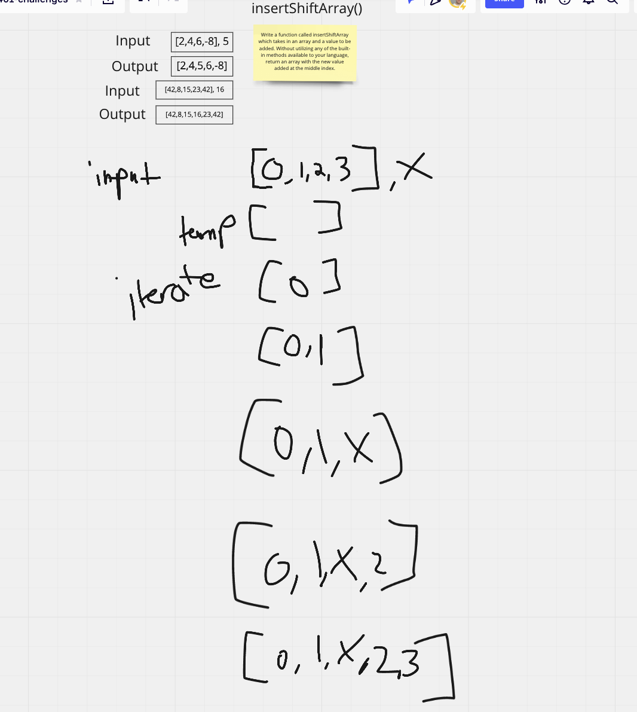

# Insert to middle of array

**Challenge**: Write a function called insertShiftArray which takes in an array and a value to be added. Without utilizing any of the built-in methods available to your language, return an array with the new value added at the middle index.

## Inputs / Outputs

Input: `[2,4,6,-8], 5`/
Output: `[2,4,5,6,-8]`

Input: `[42,8,15,23,42], 16`/
Output: `[42,8,15,16,23,42]`

## Algorithm

get length of array
if length even, insert value at the index = to the length / 2

if length odd,

## Pseudocode

```
insertShiftArray(array, x)
// INPUT <- array, value
// OUTPUT <- an array with value at the middle index of the array

declare temp <- empty array
declare length <- array.length
declare flag <- false

if length is even do
  for i <- 0 to length do
    if i == length / 2 do
      temp[i] <- x
      flag <- true
    if flag == true do
      temp[i] <- array[i - 1]
  temp[i] <- array[i]
  Increment i

else length is odd do


RETURN temp

```

## Code

[insertShiftArray](./array-insert-shift.js)

## Visual


