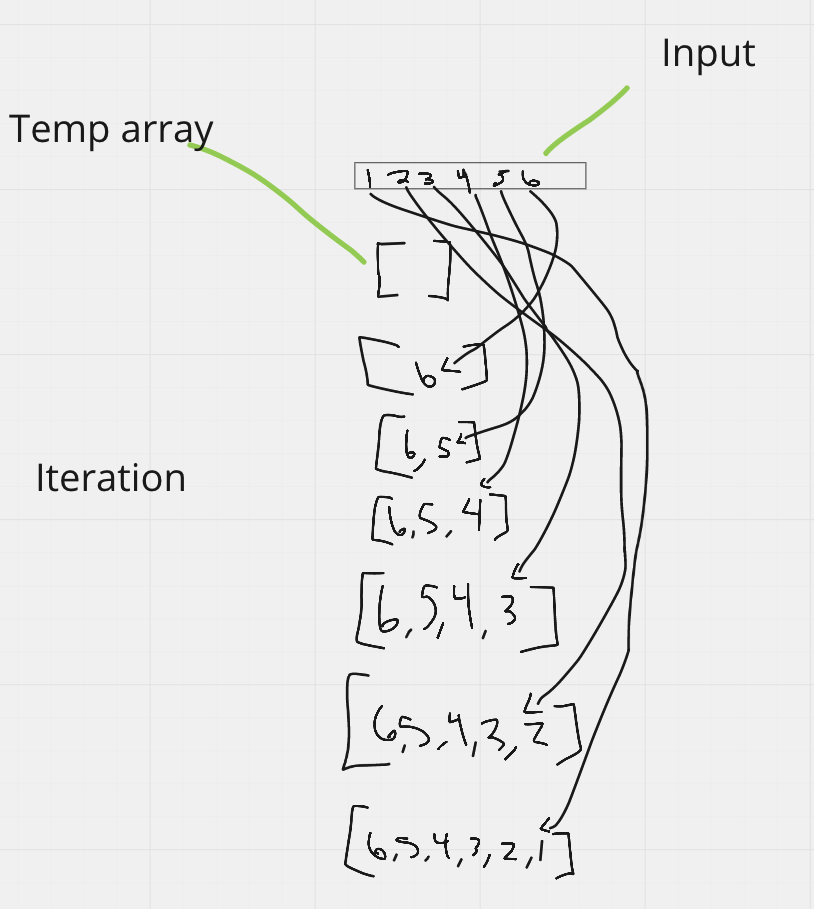

# Reverse Array

**Challenge**: Write a function called reverseArray which takes an array as an argument. Without utilizing any of the built-in methods available to your language, return an array with elements in reversed order.

## Inputs / Outputs

Input: `[1, 2, 3, 4, 5, 6]`/
Output: `[6, 5, 4, 3, 2, 1]`

## Algorithm

Create a temp array var
Iterate the array
Copy each element to the temp array

## Pseudocode

```
reverseArray(x)
// INPUT <- array
// OUTPUT <- the array reversed

declare temp <- empty array

for i <- 0 to x.length do
  temp[i] <- x[x.length - i - 1]

  Increment i

RETURN temp

```

## Code

```
function reverseArray(array) {
  let temp = [];

  for (let i = 0; i < array.length; i++) {
    temp[i] = array[array.length - i - 1];
  }
  return temp;
}
```

## Visual


