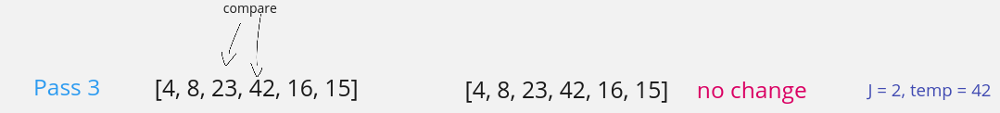

# Insertion Sort

### Algorithm

### Pseudocode

```
InsertionSort(int[] arr)

  FOR i = 1 to arr.length

    int j <-- i - 1
    int temp <-- arr[i]

    WHILE j >= 0 AND temp < arr[j]
      arr[j + 1] <-- arr[j]
      j <-- j - 1

    arr[j + 1] <-- temp
```

### Trace

Sample Array: [8,4,23,42,16,15]
Correct Output: [4,8,15,16,23,42]

##### Pass 1:


Pass 1 of Insertion Sort

In the first pass, we check if index 1 is less than index 0. It is, so we perform the switcharoo on those two values.

---
##### Pass 2:


Pass 2 of insert Sort

We check if index 2 is less than index 1. It is not, so nothing changes in the array.

---
##### Pass 3:



Pass 3 of insert Sort

We check if index 3 is less than index 2. It is not, so nothing changes in the array.

---
##### Pass 4:


Pass 4 of insert Sort

We check if index 4 is less than index 3. It is, so we perform the value movement logic across two index values and place 16 after 8.

---
##### Pass 5:


Pass 5 of insert Sort

We check if index 5 is less than index 4. It is, so we perform the value movement logic across three index values and place 15 after 8.

### Efficiency

- Time: O(n^2)

  - The basic operation of this algorithm is comparison. This will happen n \* (n-1) number of times…concluding the algorithm to be n squared.

- Space: O(1)
  - No additional space is being created. This array is being sorted in place…keeping the space at constant O(1).
